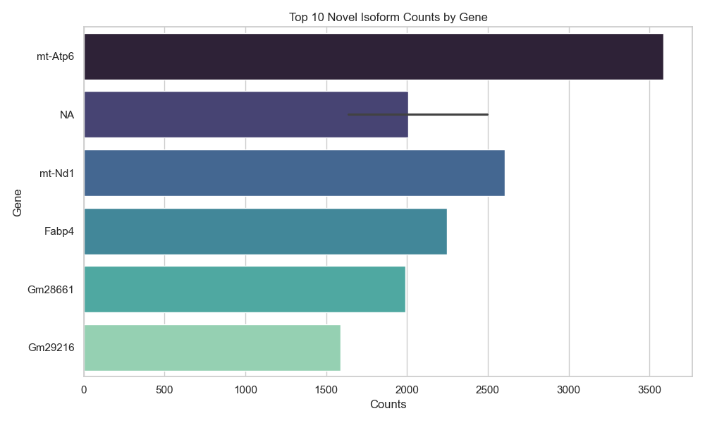
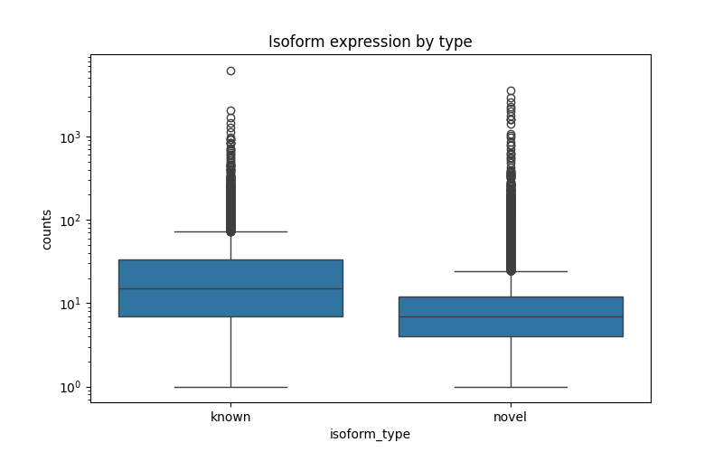

# Rough Overview

Hi! This is my mini technical demonstration for a bio-informatics project.  
This project aims to analyze long-read RNA sequencing data derived from mouse brown adipose tissue to identify and quantify known and novel transcript isoforms using the FLAIR pipeline.  

I used this dataset: [SRX28705672[accn]](https://www.ncbi.nlm.nih.gov/sra/SRX28705672[accn]), with this specific run (SRR33470049)[https://trace.ncbi.nlm.nih.gov/Traces/?view=run_browser&acc=SRR33470049&display=download]. This focuses on the murine brown adipose tissue transcriptome.  
Also known as brown fat in rodents, it is involved in heat production.  

I used publicly available nanopore sequencing data (sample SRR33470049). The workflow processes raw RNA reads through alignment, correction, isoform collapsing, and quantification steps. The result is a catalog of transcript isoforms with some novel splicing variants.  

By processing the data through a bioinformatics pipeline (alignment → correction → isoform assembly → quantification), I found that over 11,000 RNA variants were not present in existing reference databases (well, just 1). These novel isoforms could represent previously uncharacterized ways in which fat tissue regulates metabolism or adapts to the environment.  

While based on a single sample, this pipeline mimics modern transcriptomics workflows and provides a foundation for further biological insight and comparison studies.  

***

# Data Source

Stuff listed above but specifics.
Raw sequencing reads: SRR33470049 (Oxford Nanopore long-read RNA-seq from murine brown fat tissue)

Reference genome: [Mus musculus GRCm39 assembly](https://ftp.ensembl.org/pub/release-109/fasta/mus_musculus/dna/)

Annotation: GTF file from Ensembl release 109

***

# Rough Outline of what I did

## Pipeline Steps

0. Set up a working environment. Installed Python 3.12, set up virtual environment, installed conda and all required dependencies/packages.

1. Quality Control (QC)  

Used NanoPlot to evaluate read length distribution (bp), read quality, and yield.  
Making sure the data quality was sufficient for downstream isoform analysis.  

2. Read Alignment  

Aligned raw reads to the mouse reference genome using minimap2 with splice-aware settings.  
Converted SAM to sorted BAM files using samtools for efficient processing.  

3. Correction

Used FLAIR to correct splice junctions leveraging the reference annotation.  
Helped improve alignment accuracy around exon boundaries.  

4. Collapse

Collapsed corrected reads to identify unique transcript isoforms, grouping redundant isoforms together.  
Differentiated known isoforms from novel ones based on reference annotation.

5. Quantification

Quantified expression of each isoform across the sample.
Generated counts tables representing isoform abundances.

6. Analysis

Identified genes with the highest numbers of novel isoforms.
Explored isoform expression patterns specific to brown fat.
Visualized novel vs known isoform counts and expression distributions.

***

# Results

Detected ~11,394 novel isoforms alongside 4,272 known isoforms, reflecting the complexity of the brown fat transcriptome.  
Identified several genes with multiple novel isoforms, including Eif4g1, Cd36, H2-K1, and others known to play important roles in metabolism and adipose biology (talked about earlier/above).  
Long-read RNA sequencing coupled with FLAIR revealed extensive alternative splicing events not captured by short-read methods.  

  

***

# Limitations

I only used one sample and did not compare to publicly available RefSeq/GENCODE or any white papers, this was more of a tech demo.  
My reference could just be rough/incomplete.  
Only looked at specifically brown mouse fat.  
Low sensitivity could have been a possibility.   
I didn't really look into the context of the study, so not sure of the exact environmental context for these lil mice.

***

# Thanks!!
Thanks to the FLAIR tool and more importantly, their team, for their powerful isoform analysis tech.  
Data sourced from publicly available sequencing repositories (links above!).  

***

# Tech Used

The environment file is added in, but I used Python 3.12 with conda on Mac. Had a bit of issues with setting it up.  

The major packages used were NanoPlot, minimap2, samtools, pyplot, pandas, seaborn, bedtools for conversion, [FLAIR](https://www.nature.com/articles/s41467-020-15171-6) (citation below), and gzip. Also all dependencies as well.  

Install Python 3.12 alongside Pip with it. Install miniconda/anaconda. Then run a bunch of these commands.  
The Jupyter Notebook has a decent runthrough.  

`conda create --name flair_work_pls python=3.12`

`conda activate flair_work_pls`

`conda install -c bioconda minimap2 samtools`
`conda install bioconda::bedtools`
`pip install git+https://github.com/BrooksLabUCSC/flair.git`

You will need to setup Jupyter Notebook as well, but installation is also just installing the Jupyter Notebook.

***

# Biology I'm learning/getting into.

RNA sequencing/RNA seq - A laboratory technique used to study gene expression. Helps find which genes are active and how much RNA is being made.  

Isoforms - Variants of genes that are slightly tweaked and can have different effects based on that.  
Exons - Kept in the final RNA  
Introns - Removed during RNA splicing  
Enhancers - Enhances transcription of an associated gene. Boosts how much it's expressed  
Promoters - Starting point of gene copying for RNA.  
Transcription - Roughly the process of making an RNA copy of a gene. Bind the promoter, DNA starts to unwind near transcription site, RNA polymerase moves along the DNA, complementary RNA strand is synthesized, termination signal tells it to stop and mRNA is released.
Alternative Splicing - Pick different parts gene to include or skip certain parts, which will be expressed by different protein outcomes. Allows us to make SO many proteins. In humans there are roughly 20k, but basically multiplies that by a magnitude.  
Short Read sequencing - Sub 300 base pairs, high accuracy and cheaper, good for projects that require prior 2 mentioned adjectives.  
Long Read sequencing - Captures whole RNA molecules, helps id splice variants, isoforms, transcription stop/start sites. Has a higher error rate.  

***

# Citations

Tang, A.D., Soulette, C.M., van Baren, M.J. et al. Full-length transcript characterization of SF3B1 mutation in chronic lymphocytic leukemia reveals downregulation of retained introns. Nat Commun 11, 1438 (2020). https://doi.org/10.1038/s41467-020-15171-6

***

# Contact

Feel free to contact me at my [email](tal2151@columbia.edu)
I'm Thaddeus, an SWE and EMT-B certified dude who graduated from Columbia.